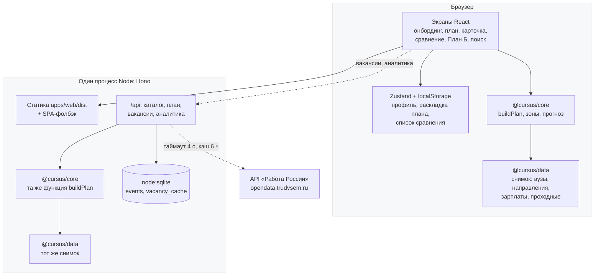

# Архитектура

## Схема

Пунктир — необязательные связи: если их нет, продукт продолжает работать.

---

## Поток данных главного сценария

1. Онбординг собирает профиль и кладёт его в `localStorage` через Zustand.
2. `buildPlan` считает план **в браузере** на снимке данных, вкомпилированном в бандл.
   Сеть для этого не нужна.
3. План хранится как раскладка — только идентификаторы вузов и направлений. Зоны, запас и
   предупреждения пересчитываются при каждом рендере: сохранённых производных значений нет,
   поэтому они не могут разойтись с данными.
4. Карточка направления берёт зарплаты из снимка, а вакансии запрашивает у `/api/vacancies`.
   Это единственное место, где нужен сервер.
5. Аналитика уходит батчами через `navigator.sendBeacon`. Если не доходит — ничего не ломается.

---

## Почему так

### Монорепозиторий с `packages/core`

Алгоритм — главная ценность и главный риск продукта. Вынесенный в отдельный пакет, он:

- считается одинаково в браузере и на сервере (`POST /api/plan` вызывает ту же функцию);
- покрыт тестами на 99% без запуска интерфейса;
- не знает ни про React, ни про HTTP, поэтому его легко проверить инвариантами на случайных данных.

### Расчёт в браузере, а не на сервере

Снимок данных — 2,6 МБ в отдельном чанке. Один раз загрузился, и дальше весь сценарий работает
без сети: план, правка приоритетов, сравнение, План Б. Для абитуриента с плохим мобильным
интернетом это разница между «работает» и «не работает». Проверяется E2E-тестом с полностью
заблокированным `/api/*`.

### Hono, а не Express или Nest

Нужен один процесс, который отдаёт статику и десяток эндпоинтов. Hono — это ~30 КБ, Fetch API
вместо своего слоя и `app.request()` для тестов без поднятия сокета. Nest притащил бы декораторы
и DI ради десяти хендлеров.

### `node:sqlite`, а не отдельная БД-служба

Аналитика и кэш вакансий — два простых набора строк. SQLite в файле на volume закрывает задачу,
не добавляя контейнер в compose и не требуя сетевого соединения при старте.

Встроенный `node:sqlite` выбран вместо `better-sqlite3`: у второго нативная сборка, которая не
собирается без Visual Studio на Windows и требует build-toolchain в Docker. Со встроенным модулем
прод-образ — это один JS-файл и статика, без `node_modules` вообще. Подробнее — в
[DECISIONS.md](DECISIONS.md).

`node:sqlite` подключается через `process.getBuiltinModule('node:sqlite')`: сборщики (Vite в тестах,
esbuild в прод-сборке) не знают об этом модуле и пытаются искать пакет `sqlite` в `node_modules`.

### Данные в репозитории, а не в базе

Снимок — это неизменяемый вход. Он лежит в git, значит:

- любой расчёт воспроизводим на любой машине;
- изменение данных видно в diff и проходит через CI;
- генератор демо-программ детерминирован, и CI проверяет, что сгенерированный файл совпадает
  с закоммиченным.

---

## Отказоустойчивость

| Что отказало | Что происходит |
| --- | --- |
| API целиком недоступен | Работает всё, кроме живых вакансий и аналитики. Вакансии показывают плашку «Живые вакансии сейчас недоступны». Проверено E2E. |
| API «Работа России» не ответил за 4 с | Отдаётся последний кэш с датой, иначе снимок из репозитория. Эндпоинт **никогда** не отвечает 5xx из-за внешнего API. |
| `localStorage` запрещён (приватный режим) | Чтение и запись обёрнуты в try/catch. Профиль не сохранится между перезагрузками, но сценарий пройдётся. |
| Буфер обмена недоступен | «Поделиться планом» показывает ссылку в `prompt`, чтобы её можно было скопировать вручную. |
| SQLite недоступен | `/api/events` отвечает 202 и не сохраняет, `/api/admin/stats` показывает нули вместо ошибки. |
| Данных по региону нет | Зарплаты показываются по России с явной подписью «по России». |
| Проходных по направлению нет | Зона не показывается вовсе — вместо выдуманного числа. |

---

## Границы ответственности

- **Cursus не подаёт документы.** Это делает суперсервис Госуслуг, на который ведёт внешняя ссылка.
- **Cursus не хранит персональные данные.** Нет регистрации, нет аккаунтов, нет e-mail. Профиль
  живёт в браузере пользователя, аналитика обезличена — см. [ANALYTICS.md](ANALYTICS.md).
- **Cursus не даёт юридических советов.** В ветке «Год на подготовку» вопрос отсрочки от армии
  отправляется в военкомат, а не решается текстом на экране.

---

## Что сознательно не сделано

| Решение | Почему |
| --- | --- |
| Нет SSR | Сценарий начинается с онбординга, индексация ради поиска по вузам не нужна: каталог — не наш продукт. |
| Нет микросервисов | Один процесс на 12 эндпоинтов. Разделять нечего. |
| Нет авторизации | Ценность не требует личного кабинета, а персональные данные создают риски по 152-ФЗ. |
| Нет drag-and-drop приоритетов | Неудобно на телефоне. Кнопки ↑ ↓ работают и пальцем, и с клавиатуры. |
| Нет очереди и воркеров | Самая долгая операция — запрос к внешнему API с таймаутом 4 с. |
